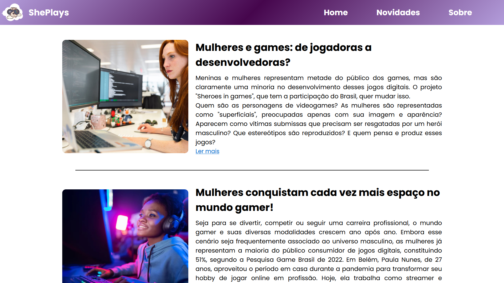

# She Plays

ShePlays é uma plaraforma Web para tudo o que acontece no universo gamer feminino. Essa pagina foi criada para exaltar a presença feminina no mundo dos e-sports.

🌐 Site: https://julliakathelyn.github.io/Mulheres-Geek/

## Home Page e Novidades

Aqui se encontram as noticias do site.

## Documentação de cores

| Cor               | Hexadecimal                                                |
| ----------------- | ---------------------------------------------------------------- |
| Lilás       | ![#b39ddb]
| Roxo       | ![#46064d] |
| Branco       | ![#ffffff] |

## Aprendizados

Com esse projeto eu aprendi a usar vw e vh em vez de px, o que ajudou na muito na responsividade do projeto, alem disso aprendi mais sobre position absolute para sobrepor as imagens com texto. Busquei entender a propriedade object-fit: cover, que foi essencial para as imagens se ajustatem conforme o tamanho ja definido. E por fim, com a ajuda de videos do Youtube aprendi a criar um carrosel de imagens usando HTML, JavaScirpt e CSS.

## Tecnologias

Esse projeto foi desenvolvido com as seguintes tecnologias:

- HTML
- CSS
- JavaScirpt
- Git e GitHub
- [Figma](https://www.figma.com/design/Tvaqk1qFZviTJF7qqLXepM/CyberZone?m=auto&t=aqLf0spbl6nppp7n-6) (Prototipo de baixa fidelidade)

